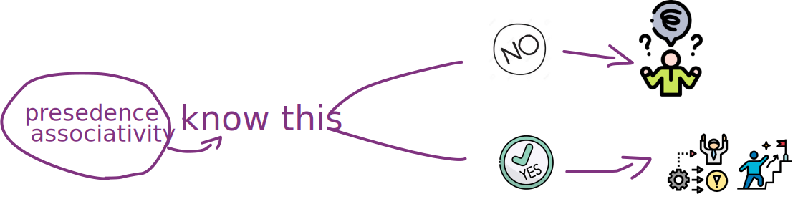

# learning-JavaScript_Manipulating-Precedence-and-associativity-logic

* * *

**JavaScript: Manipulación de Precedencia y asociatividad**

* * *

Conoceremos la implicancia y la importancia de comprender y manipular correctamente la lógica de precedencia y asociatividad.  

* * *

## implicaciones:

**1) Evitar Evaluaciones Incorrectas** en expresiones Complejas:  
**JavaScript** sigue reglas específicas para determinar el orden en que se ejecutan los operadores en una expresión. Si no comprendemos esto, podemos interpretar mal el resultado de una operación.

```JavaScript
let result = 10 + 5 * 2;
console.log(result); // ¿15 or 20?
```

```JavaScript
let result = 10 + (5 * 2 ** 3) / 4 - (6 % 4) || (7 && 0);
console.log(result); // ¿result?
```

¿Cuál operador se resuelve primero? No entender la precedencia puede llevar a errores sutiles en cálculos.

**2) Prevenir Comportamientos Inesperados** en Asignaciones:  
¡La asociatividad de los operadores también es importante!, especialmente en expresiones de asignación encadenadas.

```JavaScript
let a, b, c;
b = 75;
a = b = c = 10;
console.log(a, b, c); // ¿?, ¿?, ¿?
```
```JavaScript
let a = 1
let b = 2 
let result = a / b / 10;
console.log(result); // ¿result?
```
¿Has notado, como en el primer caso como la resolución de las operaciones se hace de derecha a izquierda y en el segundo , al contrario , lo hace de izquierda a derecha ?

**3) Comprender el Comportamiento** de los Operadores Lógicos:  
Los operadores lógicos en **JavaScript** (&&, ||, !) tienen reglas de precedencia que afectan nuestra evaluación, lo que puede llevarnos a resultados inesperados.

```JavaScript
let result = false || (false && true);
console.log(result) // ¿result?
```

**4)** Facilita la Escritura de **Código Más Claro y Mantenible**:  
Entender que es la precedencia y asociatividad permite evitar el uso innecesario de paréntesis y que podamos escribir expresiones más claras.

```JavaScript
let noClearer = ((3 + 4) * (5 - 2)) / (((6 + 3) - 4) + 3);
let clearer   = (3 + 4) * (5 - 2) / (6 + 3 - 4 + 3);
console.log(noClearer , clearer); // 2.625 , 2.625
```

¿Por qué llegamos al mismo resultado en ambos casos?

**5) Mejorar el Rendimiento** del Código:  
Cuando **JavaScript** ejecuta una expresión, sigue las reglas de precedencia y asociatividad sin necesidad de que evalúe toda nuestra expresión.

```JavaScript
let result = 1 || 5 * 5;
console.log(result); // ¿?
```
Aquí, la expresión 5 * 5 nunca se evaluará siempre que el primer término sea un valor truthy. Esto se debe a que el operador lógico || (OR) en JavaScript usa cortocircuito: si el primer operando es truthy, devuelve ese valor y no evalúa el segundo.

## **Comencemos! **:

Lo primero que debemos entender es que la **precedencia** es la prioridad o antelación de algo en relación a otra cosa y que la **asociatividad** es el orden en que se agrupan los operandos en una expresión que tiene varios operadores con la misma precedencia!, expresado en otras palabras la precedencia indica que operación (como suma, multiplicación, potenciación, etc.) es la primera en resolverse segun quien tenga mayor nivel en su precedencia, cual es la segunda, tercera , etc. La asociatividad, por otro lado, determina cómo se agrupan los operadores cuando hay varias operaciones con la misma precedencia, y si se resuelve de izquierda a derecha o de derecha a izquierda.

Pasemos a un ejemplo de precedencia para entenderlo mejor:  
La multiplicación tiene mayor precedencia que la suma, por lo que en una expresión como lo podría ser 3 + 4 \* 5, lo primero que hará **JavaScript** es realizar la multiplicación y luego la suma.

Y un ejemplo de asociatividad lo podríamos indicar con el siguiente análisis:  
Tanto el operador / como el operador \* tienen la misma precedencia motivo por el cual **JavaScript**  
para resolver la expresión 80 / 8 \* 2 verificara que la asociatividad de estos operadores es de izquierda a derecha, resolviendo primero 80 / 8 para luego multiplicarlo por dos.  
Por otro lado, también tenemos operadores con asociatividad de derecha a izquierda, como lo podría ser = (operador de asignación) donde la expresión var1 = var2 = 10 se evaluara de derecha a izquierda asignando 10 a var2 y var2 a var1.

La precedencia determina el orden en el que se resuelven las operaciones en una expresión, mientras que la asociatividad define cómo se agrupan los operadores con la misma precedencia.  
Entender estos conceptos nos permite escribir código más claro, evitar errores y mejorar el rendimiento.

Para más detalles, revisa esta tabla de precedencia en **JavaScript**.

| Precedencia | Tipo de operador | Asociatividad | Operadores individuales |
| --- | --- | --- | --- |
| 19  | Agrupamiento | n/a | `( … )` |
| 18  | Acceso a propiedades (notación por punto) | Izquierda | `… . …` |
|     | Acceso a propiedades (notación por corchetes) | Izquierda | `… [ … ]` |
|     | `new` (con lista de argumentos) | n/a | `new … ( … )` |
|     | Llamada a función | Izquierda | `… ( … )` |
|     | Encadenamiento opcional | Izquierda | `?.` |
| 17  | `new` (sin lista de argumentos) | Derecha | `new …` |
| 16  | Incremento sufijo | n/a | `… ++` |
|     | Decremento sufijo | n/a | `… --` |
| 15  | NOT lógico | Derecha | `! …` |
|     | NOT a nivel de bits | Derecha | `~ …` |
|     | Suma unaria | Derecha | `+ …` |
|     | Negación unaria | Derecha | `- …` |
|     | Incremento prefijo | Derecha | `++ …` |
|     | Decremento prefijo | Derecha | `-- …` |
|     | `typeof` | Derecha | `typeof …` |
|     | `void` | Derecha | `void …` |
|     | `delete` | Derecha | `delete …` |
|     | `await` | Derecha | `await …` |
| 14  | Potenciación (`**`) | Derecha | `… ** …` |
| 13  | Multiplicación (`*`) | Izquierda | `… * …` |
|     | División (`/`) | Izquierda | `… / …` |
|     | Resto (`%`) | Izquierda | `… % …` |
| 12  | Adición (`+`) | Izquierda | `… + …` |
|     | Sustracción (`-`) | Izquierda | `… - …` |
| 11  | Desplazamiento de bits a la izquierda (`<<`) | Izquierda | `… << …` |
|     | Desplazamiento de bits a la derecha (`>>`) | Izquierda | `… >> …` |
|     | Desplazamiento de bits a la derecha sin signo (`>>>`) | Izquierda | `… >>> …` |
| 10  | Menor a (`<`) | Izquierda | `… < …` |
|     | Menor o igual a (`<=`) | Izquierda | `… <= …` |
|     | Mayor a (`>`) | Izquierda | `… > …` |
|     | Mayor o igual a (`>=`) | Izquierda | `… >= …` |
|     | `in` | Izquierda | `… in …` |
|     | `instanceof` | Izquierda | `… instanceof …` |
| 9   | Igualdad (`==`) | Izquierda | `… == …` |
|     | Desigualdad (`!=`) | Izquierda | `… != …` |
|     | Igualdad estricta (`===`) | Izquierda | `… === …` |
|     | Desigualdad estricta (`!==`) | Izquierda | `… !== …` |
| 8   | AND a nivel de bits (`&`) | Izquierda | `… & …` |
| 7   | XOR a nivel de bits (`^`) | Izquierda | `… ^ …` |
| 6   | OR a nivel de bits (\` | \`) | Izquierda |
| 5   | AND lógico (`&&`) | Izquierda | `… && …` |
| 4   | OR lógico (\` |     | \`) |
|     | Operador de coalescencia nula (`??`) | Izquierda | `… ?? …` |
| 3   | Operador condicional (ternario) | Derecha | `… ? … : …` |
| 2   | Asignación | Derecha | `… = …` |
|     | Asignación | Derecha | `… += …` |
|     | Asignación | Derecha | `… -= …` |
|     | Asignación | Derecha | `… **= …` |
|     | Asignación | Derecha | `… *= …` |
|     | Asignación | Derecha | `… /= …` |
|     | Asignación | Derecha | `… %= …` |
|     | Asignación | Derecha | `… <<= …` |
|     | Asignación | Derecha | `… >>= …` |
|     | Asignación | Derecha | `… >>>= …` |
|     | Asignación | Derecha | `… &= …` |
|     | Asignación | Derecha | `… ^= …` |
|     | Asignación | Derecha | `… \|= …` |
|     | Asignación | Derecha | `… &&= …` |
|     | Asignación | Derecha | `… \|= …` |
|     | Asignación | Derecha | `… ??= …` |
|     | `yield` | Derecha | `yield …` |
|     | `yield*` | Derecha | `yield* …` |
| 1   | Operador coma | Izquierda | `… , …` |


**Gracias por leerme!
Marucci Mauro.**

